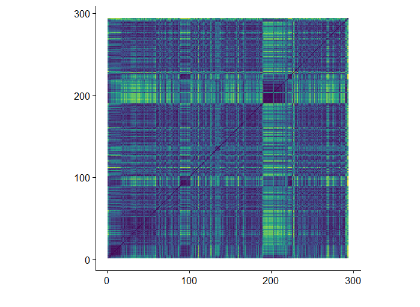

# Title

nothing fancy

## Heading

### Sub Heading

*italic* 
**bold**

bouncetimbre <- read_csv("bouncetothebeattimbre.csv")

bouncetimbre |>
  compmus_wrangle_timbre() |> 
  filter(row_number() %% 50L == 0L) |> 
  mutate(timbre = map(timbre, compmus_normalise, "euclidean")) |>
  compmus_self_similarity(timbre, "cosine") |> 
  ggplot(
    aes(
      x = xstart + xduration / 2,
      width = 50 * xduration,
      y = ystart + yduration / 2,
      height = 50 * yduration,
      fill = d
    )
  ) +
  geom_tile() +
  coord_fixed() +
  scale_fill_viridis_c(guide = "none") +
  theme_classic() +
  labs(x = "", y = "")

