# OLD vs NEW

## column 1 {width=33%}

<iframe src="https://open.spotify.com/embed/track/1EFyjeVs4hetSVMc28Y9r6"
        width="100%" height="170"
        frameborder="0"
        allowtransparency="true"
        allow="encrypted-media">
</iframe>

While listening to *GO* by Chris Stussy, I invite you into the sonic world of his music, welcome.

This portfolio presents an analysis of Chris Stussy’s musical style before and after his breakthrough track *All Night Long*, released on June 6, 2023. Throughout this portfolio, *All Night Long* serves as a central reference point, around which I compare tracks from both his earlier (OLD) and later (NEW) repertoire. In particular, I focus on a set of four representative tracks, two from before and two from after this release, to explore how his sound may have evolved.

The aim is to investigate whether this release corresponds to a measurable shift in his sonic characteristics.

As an initial intuition check, I conducted a small informal listening test with a classmate: based solely on hearing a track, I was asked to identify whether it was released before or after *All Night Long*. Despite not knowing every track in his catalogue, I was able to classify all examples correctly. This suggests that Stussy’s style underwent a perceptible transformation around this release.

In this portfolio, I examine whether this perceived shift can also be supported through computational analysis, using techniques from Music Information Retrieval (MIR).

To ensure a balanced comparison, I constructed two equally sized corpora. Following *All Night Long*, Stussy released 37 tracks; therefore, I selected the 37 most recent tracks preceding this release to represent his earlier work. This enables a controlled comparison between the OLD and NEW phases of his career.

 
## column 2 {width=33%}

 

## column 2 {width=33%}

# TRACK FEATURES

## column 1 {width=30%}

This section compares track-level features of Chris Stussy’s music before and after his breakthrough track *All Night Long*. The visualization presents multiple variables simultaneously: the x-axis distinguishes between the two periods (OLD vs. NEW), while the y-axis represents energy. Each point corresponds to a track, with color indicating musical mode (major or minor) and size representing loudness.

Several clear differences emerge between the two periods. First, tracks in the NEW category show consistently higher energy values. Notably, energy in the NEW category does not drop below approximately 0.62, whereas the OLD tracks exhibit a wider spread, including lower-energy values. This suggests a shift toward a more consistently high-energy sound in Stussy’s later productions.

In addition, the size of the points, representing loudness, tends to be larger in the NEW category. This may reflect broader industry trends such as the loudness war, where tracks are increasingly mastered at higher loudness levels. It may also indicate increased access to advanced mixing and mastering techniques as the artist’s career progressed.

The violin plot further reinforces these observations by showing the full distribution of energy values. The NEW distribution is more concentrated at higher energy levels, while the OLD distribution is more dispersed. This indicates not only an increase in average energy, but also a reduction in variability, suggesting a more consistent and refined stylistic direction in the later tracks.

Overall, these results support the hypothesis that *All Night Long* marks a shift toward a more energetic, louder, and more uniform sonic profile in Stussy’s music, aligning with a more polished and club-oriented production style.

<iframe src="https://open.spotify.com/embed/playlist/5EUlC9xTSPn6HA8EX8RcRo"
        width="100%" height="170"
        frameborder="0"
        allowtransparency="true"
        allow="encrypted-media">
</iframe>

<iframe src="https://open.spotify.com/embed/playlist/31f5Kp2KEJ9XhycHflUnJK"
        width="100%" height="170"
        frameborder="0"
        allowtransparency="true"
        allow="encrypted-media">
</iframe>

## column 2 {.tabset}

### Features

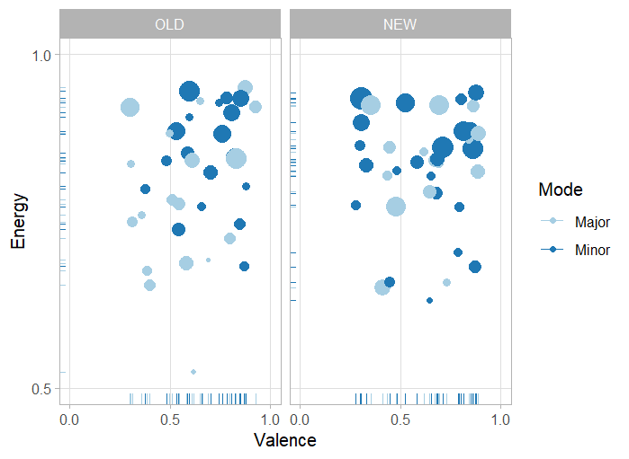

### Violin Energy

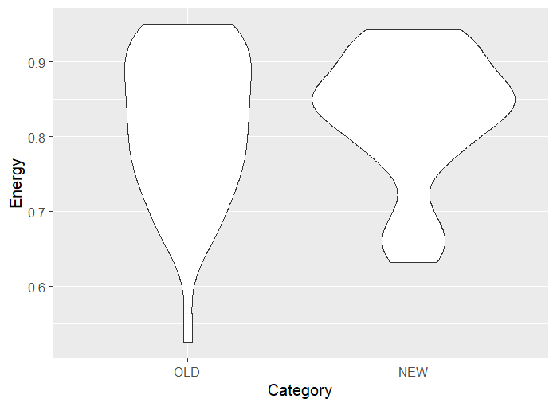

# CHROMAGRAMS

## column 1 {width=30%}

In this section, chromagrams are compared across selected tracks to examine differences in harmonic structure between the OLD and NEW periods.

A clear observation can be made in the chromagram of *All Night Long*, where a strong emphasis on the F pitch is visible throughout most of the track, represented by a persistent bright horizontal band. This indicates a stable tonal center and a clear harmonic structure.

In contrast, the OLD tracks *A Traveller on the Dusty Road* (June 3, 2022) and *Limerence* (January 25, 2021) display less clearly defined chromagrams. While *A Traveller on the Dusty Road* shows some emphasis around the D pitch, suggesting a loose tonal focus, *Limerence* lacks a single dominant pitch class, making it difficult to identify a clear key.

When comparing these to the NEW tracks *Believe in Yourself* and *About Us*, a noticeable difference emerges: the chromagrams appear more structured and easier to interpret. This suggests a stronger and more consistent harmonic foundation in the later tracks.

Listening to these tracks provides a possible explanation for this pattern. In the NEW tracks, there is a greater emphasis on tonal musical elements such as chords, pads, and melodic content. In contrast, the OLD tracks rely more heavily on percussive elements. Since percussive sounds (e.g., drums) do not have a well-defined pitch, they contribute less clearly to chroma representations, resulting in more diffuse and ambiguous chromagrams.

Overall, the comparison suggests a shift toward clearer harmonic definition in Stussy’s later work, aligning with a more structured and tonally grounded production style.

<iframe src="https://open.spotify.com/embed/track/7b4twDZXjQf8gyQGSvySZd"
        width="100%" height="170"
        frameborder="0"
        allowtransparency="true"
        allow="encrypted-media">
</iframe>

<iframe src="https://open.spotify.com/embed/track/1a4SXKsWvHmsAPpCffxhAh"
        width="100%" height="170"
        frameborder="0"
        allowtransparency="true"
        allow="encrypted-media">
</iframe>

<iframe src="https://open.spotify.com/embed/track/7xTlgtqZOAbhGGvNDiF6QB"
        width="100%" height="170"
        frameborder="0"
        allowtransparency="true"
        allow="encrypted-media">
</iframe>

<iframe src="https://open.spotify.com/embed/track/1wFW0fKAf4gEwdESW1cdqy"
        width="100%" height="170"
        frameborder="0"
        allowtransparency="true"
        allow="encrypted-media">
</iframe>

<iframe src="https://open.spotify.com/embed/track/2QJwMBAnrB6HDsS4dhTaNT"
        width="100%" height="170"
        frameborder="0"
        allowtransparency="true"
        allow="encrypted-media">
</iframe>

## {width=38%}

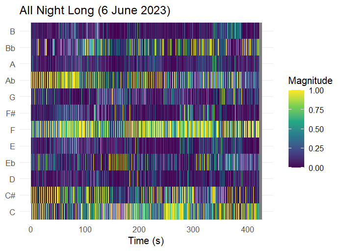

## column 2 {.tabset}

### OLD

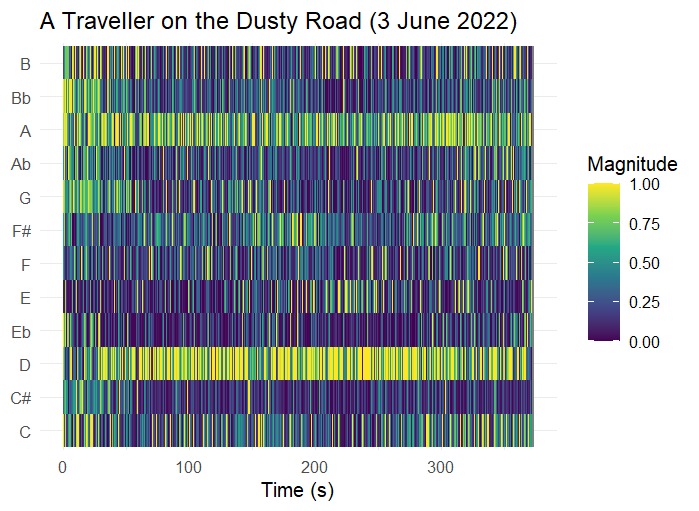

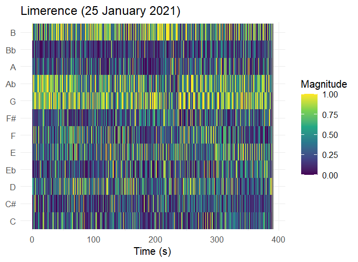

### NEW

 

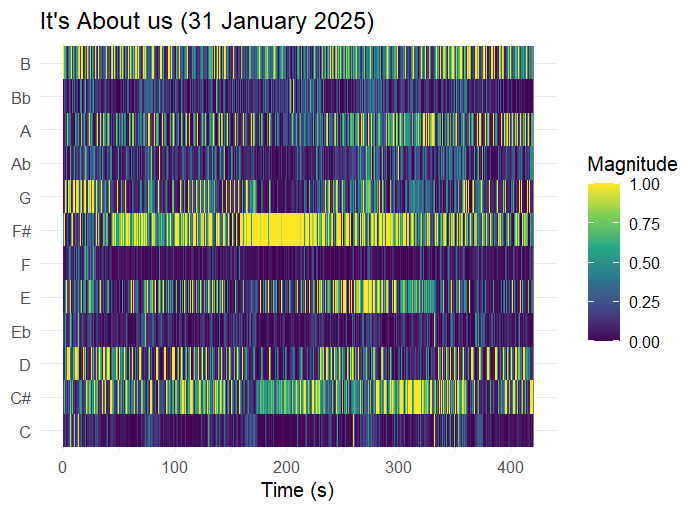

# SSM

## column 1 {width=30%}

In the timbre-based self-similarity matrices, clear differences can be observed between the OLD and NEW tracks in terms of structural clarity and repetition.

In the track *All Night Long*, the matrix appears relatively diffuse, with less clearly defined patterns. Rather than indicating randomness, this likely reflects a high level of variation in timbre and continuous micro-changes in the sound design. Elements such as layered percussion and evolving textures reduce the amount of exact repetition, resulting in a more “noisy” appearance in the SSM.

A similar level of diffuseness can be observed in the OLD tracks, where the matrices often lack clearly defined structural patterns. However, in some of the more recent tracks within the OLD category, early signs of more structured repetition begin to emerge, visible as faint checkerboard-like patterns.

This structural clarity becomes much more pronounced in the NEW tracks. In *Believe in Yourself*, for example, the SSM reveals clear block-like and checkerboard patterns, indicating strong repetition of timbral elements across different sections of the track. These patterns suggest a more deliberate and controlled arrangement.

While production quality, such as mixing and mastering, may contribute to the clarity of individual elements, the primary factor reflected in the SSM is the degree of structural repetition and consistency in timbre. The clearer patterns in the NEW tracks therefore point toward a shift in Stussy’s production style, with a stronger emphasis on structured, repeatable sonic elements.

Overall, the timbre-based SSMs suggest that Stussy’s newer work exhibits greater structural coherence and clearer segmentation, compared to the more diffuse and less repetitive patterns found in his earlier productions.

<iframe src="https://open.spotify.com/embed/track/7b4twDZXjQf8gyQGSvySZd"
        width="100%" height="170"
        frameborder="0"
        allowtransparency="true"
        allow="encrypted-media">
</iframe>

<iframe src="https://open.spotify.com/embed/track/1a4SXKsWvHmsAPpCffxhAh"
        width="100%" height="170"
        frameborder="0"
        allowtransparency="true"
        allow="encrypted-media">
</iframe>

<iframe src="https://open.spotify.com/embed/track/7xTlgtqZOAbhGGvNDiF6QB"
        width="100%" height="170"
        frameborder="0"
        allowtransparency="true"
        allow="encrypted-media">
</iframe>

<iframe src="https://open.spotify.com/embed/track/1wFW0fKAf4gEwdESW1cdqy"
        width="100%" height="170"
        frameborder="0"
        allowtransparency="true"
        allow="encrypted-media">
</iframe>

<iframe src="https://open.spotify.com/embed/track/2QJwMBAnrB6HDsS4dhTaNT"
        width="100%" height="170"
        frameborder="0"
        allowtransparency="true"
        allow="encrypted-media">
</iframe>

## {width=38%}

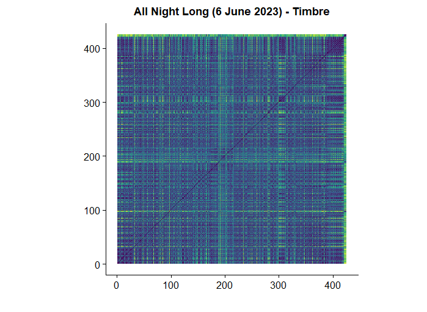

## column 2 {.tabset}

### OLD

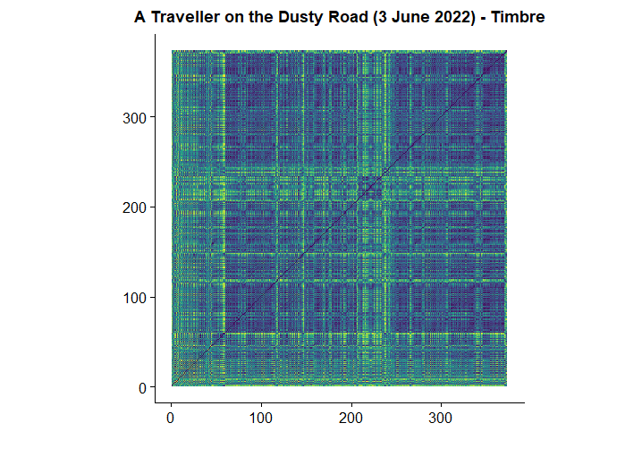

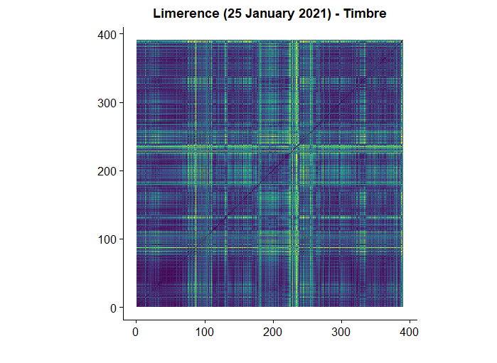

### NEW

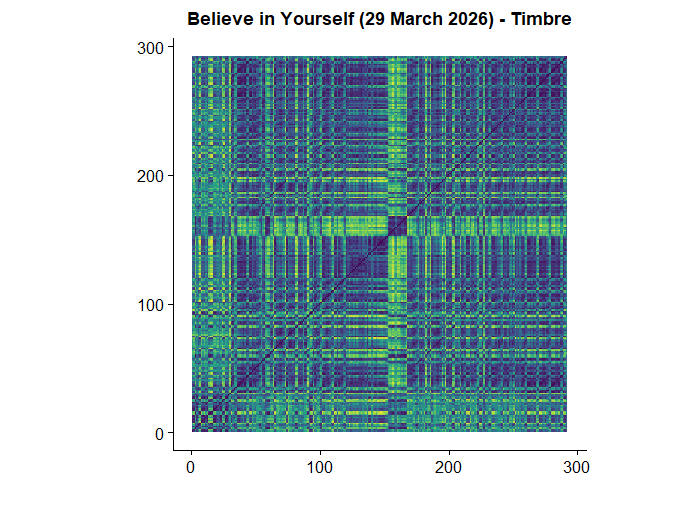

# KEYGRAM

## column 1 {width=25%}

In this section, keygrams are analyzed to investigate tonal stability across the selected tracks.

<iframe src="https://open.spotify.com/embed/track/7b4twDZXjQf8gyQGSvySZd"
        width="100%" height="170"
        frameborder="0"
        allowtransparency="true"
        allow="encrypted-media">
</iframe>

For *All Night Long*, a single, clearly defined horizontal band is visible at F minor, indicating a strong and stable tonal center throughout the track. This suggests that the harmonic structure is well-defined and consistently maintained over time.

<iframe src="https://open.spotify.com/embed/track/1a4SXKsWvHmsAPpCffxhAh"
        width="100%" height="170"
        frameborder="0"
        allowtransparency="true"
        allow="encrypted-media">
</iframe>

In contrast, *A Traveller on the Dusty Road* shows multiple distinct horizontal activations, particularly around keys related to D. While a tonal focus is present, it appears less stable and more distributed compared to *All Night Long*, indicating a more ambiguous harmonic structure.

<iframe src="https://open.spotify.com/embed/track/7xTlgtqZOAbhGGvNDiF6QB"
        width="100%" height="170"
        frameborder="0"
        allowtransparency="true"
        allow="encrypted-media">
</iframe>

The keygram of *Limerence* is considerably more diffuse. At the beginning of the track, there is little clear tonal focus, with low-confidence activations spread across many keys. However, between approximately 220 and 300 seconds, several keys become more strongly activated simultaneously. This may be explained by the presence of richer or more sustained harmonic content, such as layered or “smeared” chords, which distribute energy across multiple pitch classes and reduce the clarity of a single tonal center.

<iframe src="https://open.spotify.com/embed/track/1wFW0fKAf4gEwdESW1cdqy"
        width="100%" height="170"
        frameborder="0"
        allowtransparency="true"
        allow="encrypted-media">
</iframe>

Among the NEW tracks, *Believe in Yourself* presents the clearest keygram, with strong and stable horizontal bands, indicating a well-defined tonal structure. This suggests a more controlled harmonic foundation in Stussy’s later productions.

<iframe src="https://open.spotify.com/embed/track/2QJwMBAnrB6HDsS4dhTaNT"
        width="100%" height="170"
        frameborder="0"
        allowtransparency="true"
        allow="encrypted-media">
</iframe>

Interestingly, *About Us* does not exhibit the same level of clarity, despite containing many audible melodic and harmonic elements. This can be explained by the interaction between complex musical detail and the limitations of key estimation. The presence of dense percussion, combined with numerous melodic embellishments and subtle variations, distributes pitch information more broadly across the signal. As a result, the keygram appears more diffuse, even though the track may still have a clear perceived tonal center.

Overall, these observations suggest that while Stussy’s newer tracks tend to exhibit stronger tonal definition, the clarity of keygrams is influenced not only by harmonic content, but also by rhythmic density and the complexity of the musical texture.

## {width=38%}

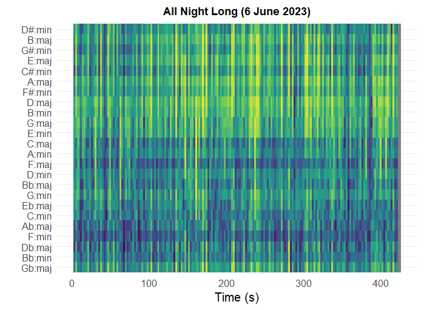

## column 2 {.tabset}

### OLD

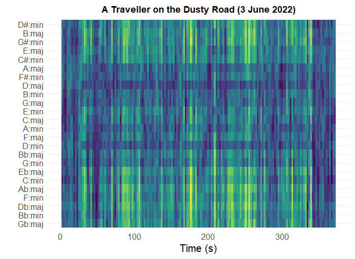

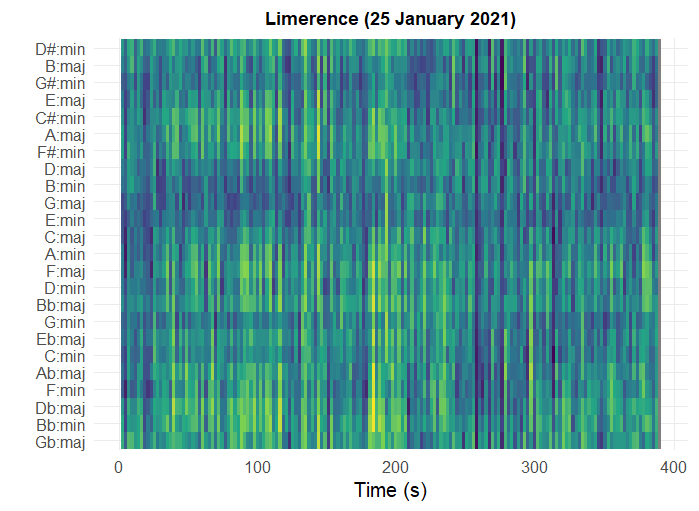

### NEW

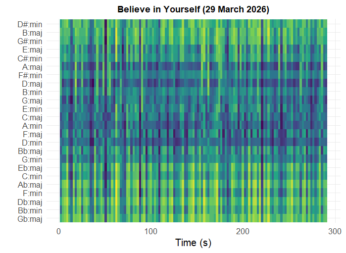

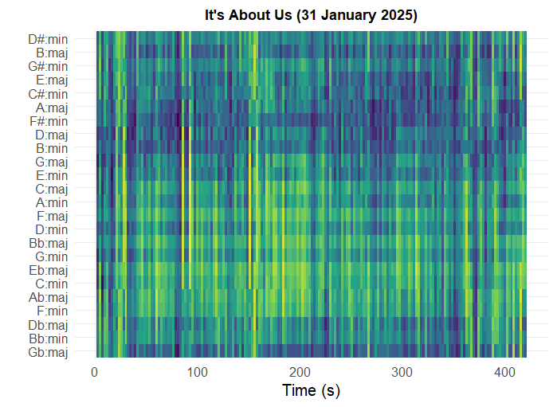

# CHORDOGRAM

## column 1 {width=25%}

The chordograms show patterns that are largely consistent with the observations from the keygram analysis. In general, tracks with a clearly defined tonal center in the keygram also display more stable and interpretable chord structures.

For example, *All Night Long* exhibits a relatively clear and consistent chordogram, aligning with its strong tonal focus in F minor. This suggests that the harmonic content is not only centered around a single key, but also organized into recognizable chord patterns.

Similarly, the OLD tracks tend to display more diffuse and less clearly defined chordograms. This reflects a higher degree of harmonic ambiguity, where chord structures are less explicitly represented or more difficult to detect. This aligns with the earlier observation that these tracks contain more percussive elements and less clearly articulated harmonic content.

In the NEW tracks, chordograms generally appear more structured and stable, indicating a stronger and more consistent use of harmonic progressions. However, as seen in *About Us*, even tracks with rich melodic content can produce more diffuse chordograms when the musical texture is dense and contains many overlapping elements.

Overall, the chordogram analysis reinforces the findings from the keygrams: Stussy’s later productions tend to exhibit clearer harmonic organization, while earlier tracks are more ambiguous. At the same time, both representations highlight the limitations of chord detection in rhythm-focused electronic music, where percussive elements and complex textures can obscure harmonic structure.

<iframe src="https://open.spotify.com/embed/track/7b4twDZXjQf8gyQGSvySZd"
        width="100%" height="170"
        frameborder="0"
        allowtransparency="true"
        allow="encrypted-media">
</iframe>

<iframe src="https://open.spotify.com/embed/track/1a4SXKsWvHmsAPpCffxhAh"
        width="100%" height="170"
        frameborder="0"
        allowtransparency="true"
        allow="encrypted-media">
</iframe>

<iframe src="https://open.spotify.com/embed/track/7xTlgtqZOAbhGGvNDiF6QB"
        width="100%" height="170"
        frameborder="0"
        allowtransparency="true"
        allow="encrypted-media">
</iframe>

<iframe src="https://open.spotify.com/embed/track/1wFW0fKAf4gEwdESW1cdqy"
        width="100%" height="170"
        frameborder="0"
        allowtransparency="true"
        allow="encrypted-media">
</iframe>

<iframe src="https://open.spotify.com/embed/track/2QJwMBAnrB6HDsS4dhTaNT"
        width="100%" height="170"
        frameborder="0"
        allowtransparency="true"
        allow="encrypted-media">
</iframe>

## {width=38%}

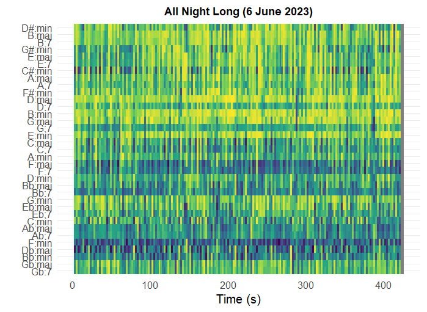

## column 2 {.tabset}

### OLD

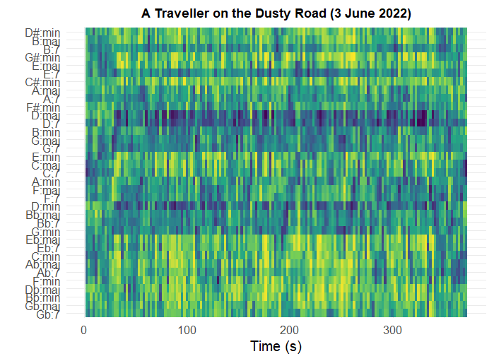

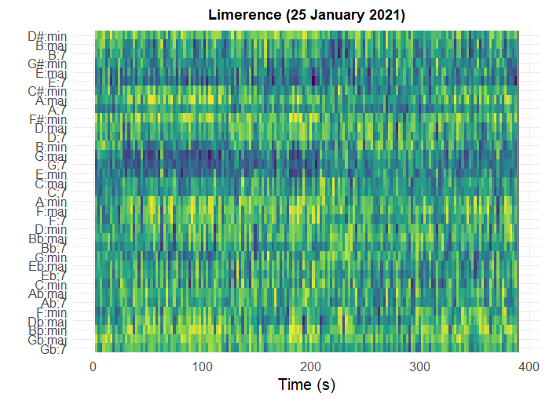

### NEW

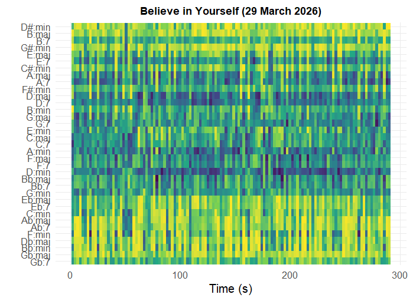
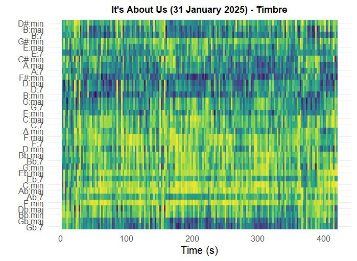

# TEMPOGRAM (DFT)

## column 1 {width=30%}

In this section, tempograms are used to analyze the temporal structure of the selected tracks.

Across all tracks, the tempo appears highly stable over time. This is expected, as house music typically maintains a constant tempo to support danceability and ensure rhythmic consistency for listeners on the dance floor. No clear examples of tempo changes or fluctuations were observed in the selected corpus.

However, an interesting phenomenon emerges when examining the Fourier-based tempograms. In some cases, the expected tempo is not represented by the strongest activation. Instead, higher-order tempo harmonics, particularly the double tempo, are more prominently visible. As noted in the literature, “the Fourier tempogram does not show a strong peak at the expected tempo, but instead highlights its double (harmonic), suggesting that the signal contains stronger periodicity at the subdivision level than at the beat level.” This implies that tempo perception may differ from the dominant periodicity detected by Fourier analysis.

A clear example of this can be observed in the track *Believe in Yourself* from the NEW category. In this case, the tempogram primarily emphasizes the double tempo rather than the fundamental tempo. Listening to the track provides a clear explanation: the intro features a highly prominent hi-hat pattern, with four hi-hat hits per kick drum, corresponding to a sixteenth-note pattern. This introduces a stronger periodicity at the subdivision level than at the level of the main beat, causing the harmonic tempo to dominate the representation.

A further important observation concerns sections where percussive elements are reduced or absent. In several of the NEW tracks, the tempogram shows little to no activity during these moments. All visible tempo-related structures across both the fundamental and its harmonics disappear when the drums drop out.

This reveals an important limitation of Fourier-based tempograms: they rely heavily on clear onset patterns, typically provided by percussive elements. While the perceived tempo of the track remains stable for the listener, the computational representation fails to capture this when rhythmic cues are not strongly present in the signal.

Overall, these findings highlight a distinction between perceived tempo and detected periodicity. While Stussy’s tracks maintain a consistent tempo throughout, the tempogram primarily reflects the presence of percussive structure rather than the full musical sense of timing.

<iframe src="https://open.spotify.com/embed/track/7b4twDZXjQf8gyQGSvySZd"
        width="100%" height="170"
        frameborder="0"
        allowtransparency="true"
        allow="encrypted-media">
</iframe>

<iframe src="https://open.spotify.com/embed/track/1a4SXKsWvHmsAPpCffxhAh"
        width="100%" height="170"
        frameborder="0"
        allowtransparency="true"
        allow="encrypted-media">
</iframe>

<iframe src="https://open.spotify.com/embed/track/7xTlgtqZOAbhGGvNDiF6QB"
        width="100%" height="170"
        frameborder="0"
        allowtransparency="true"
        allow="encrypted-media">
</iframe>

<iframe src="https://open.spotify.com/embed/track/1wFW0fKAf4gEwdESW1cdqy"
        width="100%" height="170"
        frameborder="0"
        allowtransparency="true"
        allow="encrypted-media">
</iframe>

<iframe src="https://open.spotify.com/embed/track/2QJwMBAnrB6HDsS4dhTaNT"
        width="100%" height="170"
        frameborder="0"
        allowtransparency="true"
        allow="encrypted-media">
</iframe>

## {width=38%}

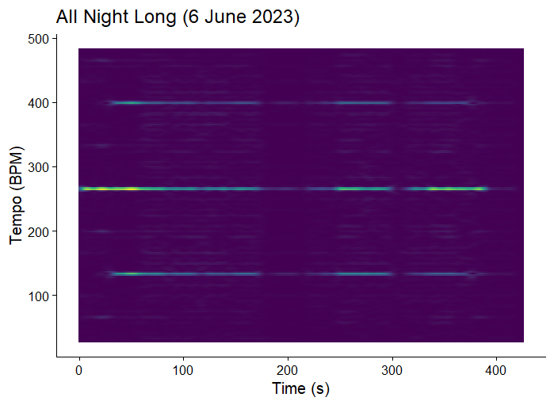 

## column 2 {.tabset}

### OLD

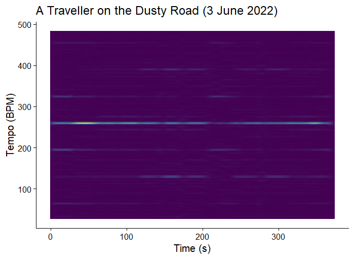

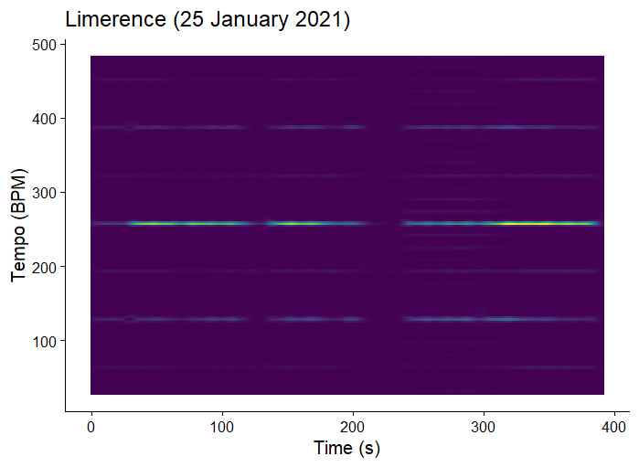

### NEW

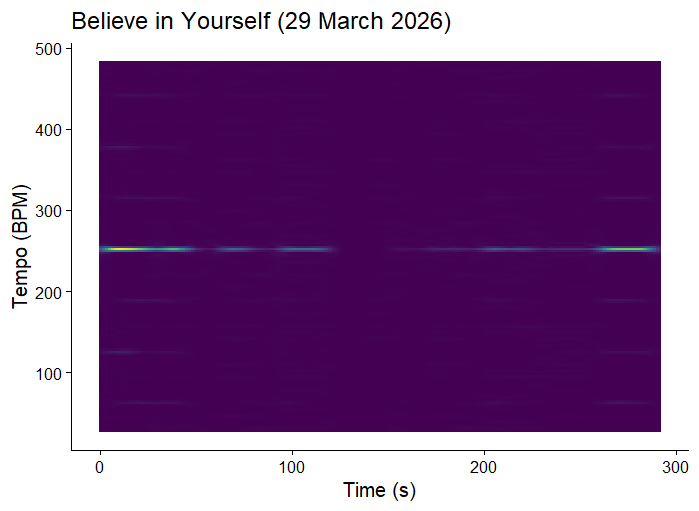

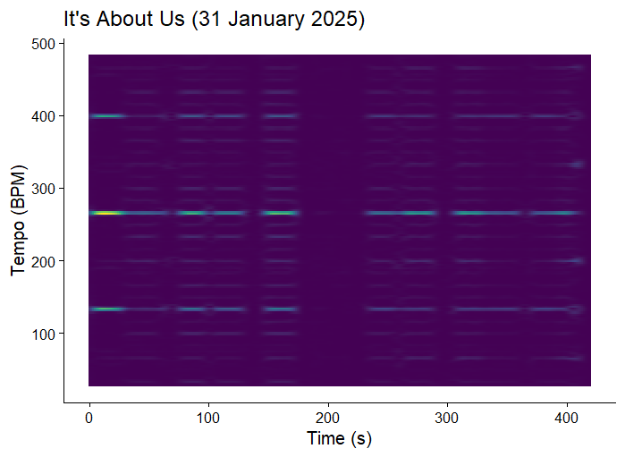

# CLASSIFICATION

## column 1 {width=40%}

In this section, a random forest classifier is used to identify which track-level features best distinguish between the OLD and NEW tracks.

The feature importance analysis shows that *speechiness* and *tempo* are among the most influential variables in separating the two groups. This suggests that these features play a key role in the stylistic shift observed after *All Night Long*.

A notable finding is the increased importance of speechiness in the NEW tracks. This indicates a greater presence of vocal elements, such as spoken phrases or vocal samples. From a musical and commercial perspective, this is particularly relevant, as tracks that include vocals are often more memorable and accessible to audiences. In both streaming contexts and club environments, the ability for listeners to recognize or engage with vocal elements can contribute to a track’s popularity.

In addition, tempo emerges as a distinguishing feature, with the NEW tracks tending toward slightly higher BPM values. A possible explanation for this can be found in performance context. As artists gain popularity, they are more likely to perform as headliners, where higher-energy sets, often associated with higher tempos, are expected. This aligns with statements by Chris Stussy himself, who has indicated in interviews that his production style has been influenced by his position within line-ups, adapting his music to suit different performance roles.

Overall, the classification results suggest that Stussy’s newer productions are not only more energetic, but also more vocally driven and performance-oriented, reflecting a shift toward a sound that is both more engaging for audiences and better suited to larger-scale club settings.

<iframe src="https://open.spotify.com/embed/playlist/5EUlC9xTSPn6HA8EX8RcRo"
        width="100%" height="170"
        frameborder="0"
        allowtransparency="true"
        allow="encrypted-media">
</iframe>

<iframe src="https://open.spotify.com/embed/playlist/31f5Kp2KEJ9XhycHflUnJK"
        width="100%" height="170"
        frameborder="0"
        allowtransparency="true"
        allow="encrypted-media">
</iframe>

## {height=100%} 

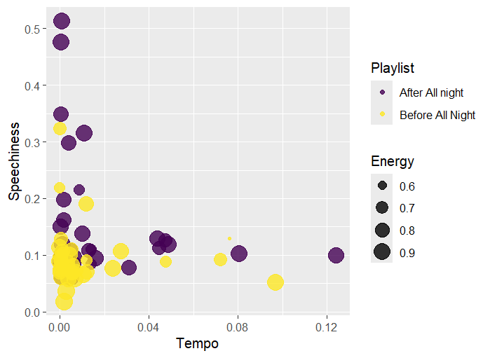

# CONCLUSION

This portfolio set out to investigate whether Chris Stussy’s breakthrough track *All Night Long* marks a measurable shift in his musical style. Based on both perceptual listening and computational analysis, the results consistently support this hypothesis.

Across multiple levels of analysis, clear differences emerge between the OLD and NEW tracks. At the level of track features, the NEW tracks are characterized by higher energy, increased loudness, and slightly higher tempos, suggesting a shift toward a more intense and club-oriented sound. The increased importance of speechiness further indicates a greater use of vocal elements, making the tracks more engaging and accessible to audiences.

Harmonic analyses reinforce this development. Chromagrams and keygrams show that the NEW tracks tend to exhibit clearer tonal centers and more stable harmonic structures, while the OLD tracks are more diffuse and ambiguous. Chordograms confirm this pattern, revealing a stronger and more consistent use of harmonic progressions in the later work.

At the level of timbre and structure, the self-similarity matrices demonstrate a shift toward greater structural clarity and repetition. The NEW tracks display more clearly defined sections and recurring patterns, indicating a more deliberate and controlled approach to arrangement.

At the same time, the tempogram analysis highlights an important nuance. While tempo remains constant across all tracks, the computational representation of tempo is strongly dependent on percussive elements. When drums are removed, tempo-related information largely disappears from the tempogram, even though the perceived tempo remains stable. This reveals a limitation of the method and emphasizes the distinction between musical perception and computational detection.

Taken together, these findings suggest that Stussy’s evolution is not limited to a single musical dimension, but spans multiple aspects of production, including energy, harmony, structure, and performance context. His newer work appears more refined, more structured, and more aligned with large-scale club environments, reflecting both artistic development and changes in professional context.

Overall, this portfolio demonstrates how computational music analysis can both confirm intuitive listening impressions and reveal deeper structural patterns. At the same time, it highlights the importance of critically interpreting these representations, as they capture only certain aspects of musical experience. By combining listening and analysis, a more complete understanding of musical style and its evolution can be achieved.

